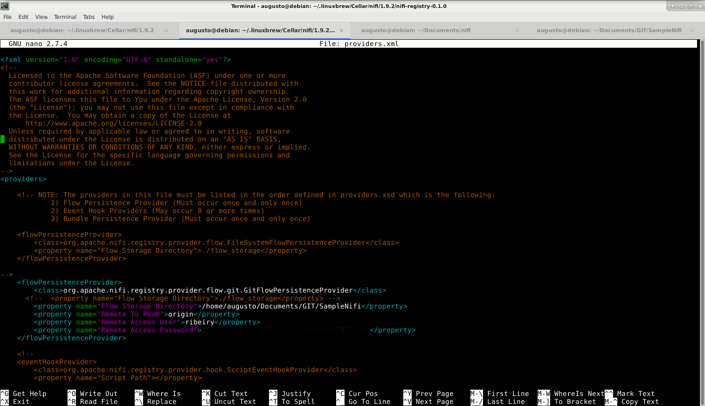

# SampleNifi

Sample Nifi é o repositorio que tem o objetivo de efetuar uma POC(Prove Of Concept) de que é possivel efetuar o versionamento do DataFlow do Nifi no GitHub.

### Passo a passo efetuar essa POC foi feita da seguinte forma:

1. Instalando o Nifi;
2. Feito um diagrama simples;
3. Instalação do Nifi-Registry;
4. Criação deste repositorio;
5. Configuração do Personal Access Token do GitHub;
6. Configuração do Nifi-Registry para que seja efetua o commit na pasta criada apartir do Repositorio;
7. Criação do Bucket no Nifi Registry;
8. Habilitar no Nifi o versionamento do Grupo;
9. Efetuar o push.

**Atenção para conseguir efetuar o versionamento do DataFlow via git é necessário que a versão minima do Nifi-Registry seja 0.2.0, a versão utilizada neste Sample foi a 0.4.0** 

Informações Obtidas apartir do seguinte tutorial:

[Link do Tutorial](https://community.hortonworks.com/articles/210286/storing-apache-nifi-versioned-flows-in-a-git-repos.html) 

Imagem do passo 6 

Caminho do arquivo `./conf`

	
